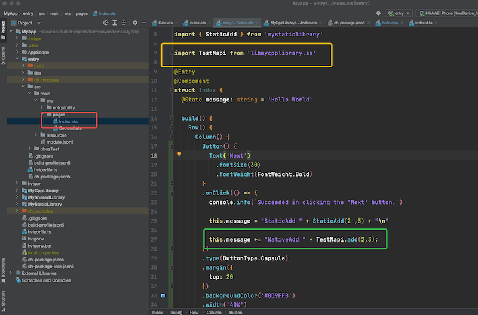

# 1. 背景
鸿蒙官宣未来不支持 Android，因此需要研究一下我们 SDK 如何适配 鸿蒙

鸿蒙开发者官网： https://developer.harmonyos.com/

当前鸿蒙使用 ArkTS 进行开发，可以实现与 JS ，TS，C++ 的调用

ArkTS 使用鸿蒙的包管理工具 ohpm ，来替换 npm，更多细节见 **环境分析**
# 2. 相关链接

鸿蒙 gitee ： https://gitee.com/openharmony/docs/blob/master/zh-cn/release-notes/OpenHarmony-v4.0-release.md

鸿蒙应该支持标准的 POSIX 接口，协议栈的编译理论走 Linux 能走通

https://github.com/rust-lang/compiler-team/issues/568
https://doc.rust-lang.org/nightly/rustc/platform-support.html

rust tier3 支持目前是 OK 的

鸿蒙开发指南： https://developer.harmonyos.com/cn/docs/documentation/doc-guides-V3/start-overview-0000001478061421-V3

开发工具 DevEco Studio 指南： https://developer.harmonyos.com/cn/docs/documentation/doc-guides-V3/deveco_overview-0000001053582387-V3

鸿蒙 SDK 开发指南 ：https://developer.harmonyos.com/cn/docs/documentation/doc-guides-V3/creating_har_api9-0000001518082393-V3

鸿蒙 手动导入 module ： https://developer.harmonyos.com/cn/docs/documentation/doc-guides-V3/creating_har_api9-0000001518082393-V3#section611662614153

鸿蒙 Native 开发：https://developer.harmonyos.com/cn/docs/documentation/doc-guides-V3/napi-guidelines-0000001493903956-V3

如何使用DevEco Studio创建Native C++应用：https://ost.51cto.com/posts/21366

【开源三方库】Aki：一行代码极简体验 JS&C++ 跨语言交互 ： https://xie.infoq.cn/article/733a3be6a1e30411f896a6888

【ArkUI】【HarmonyOS】鸿蒙ets项目如何npm方式引入第三方js类库
https://developer.huawei.com/consumer/cn/forum/topic/0202769537680520280?fid=0102683795438680754

# 3. 环境分析

# 3.1 API 版本的包管理工具

API8 及其以上使用 ohpm 依赖 （当前鸿蒙官网全部基于 API9）

API8 以下可以使用 npm 依赖 

注：华为 mate30 鸿蒙 4.0 可以直接在 Android Studio 上运行 Android 项目

鸿蒙 4.0 在 Android Studio 的编译链上各种效果和运行 Android 系统完全一致

鸿蒙 4.0 在鸿蒙编译链上无法运行 Android 项目

## 3.2 平台差异

|平台|API 版本|包管理工具|开发 App |开发 SDK
|---|--------|--------|---------|------
Mac|API9|ohpm|YES|NO
Windows|各个 API 版本|ohpm 或 npm|YES|YES

# 4. 方案讨论
## 4.1 仿照 Flutter 方案（不支持）
Flutter 方案是使用 Flutter 封装 Android SDK，Android SDK 封装协议栈

类似的 ArkTS 封装 Android SDK ，Android SDK 封装协议栈

结论：不支持，Android SDK 引入有很多 Android 的包，而鸿蒙4.0 编译链没有这些包了，无法使用

## 4.2 基于纯 java 开发（不支持）
纯 Java 调用协议栈，开发一个 SDK，尽量复用现有的 Android SDK 代码

结论：不支持，当前鸿蒙的文档只提到使用 ArkTS 开发，没有提到 Java。并且使用鸿蒙开发工具也创建不出来 Java 项目了

## 4.3 基于现有 Web SDK （不支持）
Web SDK 使用 TS ，可以使用 windows 平台使用 API6（低版本）通过 npm 集成 Web SDK ，但是 SDK 集成报错

结论：不支持，会各种报错，例如用来记录未读数的 localStorage 在鸿蒙系统没有

## 4.4 基于 ArkTS 开发鸿蒙 SDK（建议）
这个是官方的推荐，而且只能在 windows 平台开发，见 5 的调研结果

基本流程是用 windows 创建鸿蒙的静态库，ArkTS 封装 so 开发


# 5. Windows module 迁移 Mac 调研
## 5.1 结论：
Windows 创建的 Module 迁移至 Mac 后，StaticLibrary ，C++Library 均可使用

Demo 代码仓库地址：https://github.com/loginSin/HarmonyosDemo

后续所有内容的讲解均已 Demo 代码为例

## 5.2 前提
我们均用 Mac 环境开发，所以需要调研 windows 平台创建 module 项目能否直接到 Mac 系统使用

处理方式：Windows 建好 app 项目，同时在 app 目录分别创建 SharedLibrary，StaticLibrary，NativeC++ 这三个 module

前提：
1. 必须保证 node npm ohpm 保存在系统 PATH 中
2. 华为的 DevEco Studio 和 Android Studio 同时打开时任意一个 Studio 均无法调试

## 5.3 SharedLibrary （不支持）
Mac 系统直接依赖动态库 module 

结论：不行，只要依赖了动态库，哪怕不使用动态库的代码，直接运行也会报错
```java
10/31 14:28:52: Launching com.example.myapp
$ hdc shell am force-stop com.example.myapp
$ hdc shell bm uninstall com.example.myapp
$ hdc file send /Users/qi/DevEcoStudioProjects/MyApp/entry/build/default/outputs/default/entry-default-unsigned.hap /sdcard/8240b4ae99334027bfadb6043f4370b4/entry-default-unsigned.hap
$ hdc shell bm install -p /sdcard/8240b4ae99334027bfadb6043f4370b4/
Failure[MSG_ERR_INSTALL_DEPENDENT_MODULE_NOT_EXIST]
$ hdc shell rm -rf /sdcard/8240b4ae99334027bfadb6043f4370b4
Error while Deploying HAP
```

## 5.4 StaticLibrary （支持：纯 ArkTS）

Mac 系统可以直接依赖静态库

并且用 app 可以成功调用 静态库的代码

分析：StaticLibrary 是一个模块，可以直接依赖

### 5.4.1 添加、移除依赖

```shell
# 依赖静态库
➜  MyApp git:(master) ohpm install ./MyStaticLibrary
install completed in 0s 8ms

# 移除依赖
➜  MyApp git:(master) ohpm uninstall ./MyStaticLibrary
uninstall completed in 0s 7ms
```

### 5.4.2 编写代码
按照 TS 规范编写代码，创建好文件夹和 ArkTS 类写好方法并用 export 声明


### 5.4.3 将代码导出
在 MyStaticLibrary 根目录的 index.ets 中导出对应的方法


### 5.4.4 在 App 层使用静态库

红框内是 App 的首页，黄框导入静态库的方法，绿框调用静态库方法aa


## 5.5  NativeC++ （支持：ArkTS & C++）
分析：C++ Module 是一个完成的 C++ 项目，**自行编译之后会产生两个 so 文件**

详细见 5.5.2

### 5.5.1 添加、移除依赖
和 静态库相同，需要额外处理，见后续文档

### 5.5.2 预编译
1. 先选中 MyCppLibrary 编译一下，这样 ArkTS so 和 C++ so 都会自动生成


2. 目录结构

```java
cpp/
├── CMakeLists.txt  
├── hello.cpp // C++ 类
└── types // 重点，这里面是 ArkTS so
    └── libmycpplibrary // ArkTS so 名称，和 C++ so 同名
        ├── index.d.ts // 导出文件，类似静态库的 index.ets，用于导出 C++ 方法，方便 ArkTS 调用
        └── oh-package.json5 // ohpm 配置文件


此处可以看到 ArkTS so 实际是个文件夹，里面保存的是用于导出接口的 ts 文件和配置文件
```

3. ArkTS 的所在位置
截图中可以看到  MyCppLibrary/oh_modules@types/libmycpplibrary.so/index.d.ts

这就是为什么上面说的 ArkTS so 是个文件夹


4. C++ so 位置

MyCppLibrary/build/default/intermediates/cmake/default/obj/arm64-v8a/libmycpplibrary.so

这个路径是 C++ so


### 5.5.3 开发代码
需要说明是鸿蒙系统有和 JNI 类似的一个适配层（NAPI = Node API），用于对接 ArkTS 和 C++

接下来的核心代码均在  cpp/hello.cpp 中可以看到

#### 5.5.3.1 将 C++ so 注册到鸿蒙系统

```cpp
// 1. 声明有一个 C++ so 库，固定写法。nm_register_func 、nm_modname 是需要按需改动的
static napi_module demoModule = {
    .nm_version =1,
    .nm_flags = 0,
    .nm_filename = nullptr,
    .nm_register_func = Init, // 注册方法，用于将 ArkTS API 和 C++ API 绑定并注册到鸿蒙系统
    .nm_modname = "MyCppLibrary", // so 的名字，最终 so 名称会变为纯小写
    .nm_priv = ((void*)0),
    .reserved = { 0 },
};

// 2. 将 so 库注册到鸿蒙系统中
extern "C" __attribute__((constructor)) void RegisterMyCppLibraryModule(void)
{
    napi_module_register(&demoModule);
}
```

#### 5.5.3.2 将 ArkTS API 和 C++ API 绑定

```cpp
// 固定写法
EXTERN_C_START
static napi_value Init(napi_env env, napi_value exports)
{
    napi_property_descriptor desc[] = {
    //一个固定的结构
    // 第一个字符串是指在 ArkTs 的方法名
    // 第二个字符串是在在 C++ 的方法名
    // 和 JNI 差异较大的是 JNI 需要写完整的方法声明（如参数列表和返回值）
    // ArkTS 的 NAPI 只需要做 TS 和 C++ 方法名的映射即可，在 C++ 代码内部做参数和返回值的处理
        { "add", nullptr, Add, nullptr, nullptr, nullptr, napi_default, nullptr },
        { "sub", nullptr, Sub, nullptr, nullptr, nullptr, napi_default, nullptr },
        { "appendString", nullptr, AppendString, nullptr, nullptr, nullptr, napi_default, nullptr }
    };
    napi_define_properties(env, exports, sizeof(desc) / sizeof(desc[0]), desc);
    return exports;
}
EXTERN_C_END
```
#### 5.5.3.3 写 C++ 代码
```cpp
// 固定写法
static napi_value Add(napi_env env, napi_callback_info info)
{
    size_t requireArgc = 2;
    size_t argc = 2;
    // 声明有两个参数
    napi_value args[2] = {nullptr};

    napi_get_cb_info(env, info, &argc, args , nullptr, nullptr);

    // 1. 把第一个参数从系统变量中读取出来，保存为 napi_valuetype
    napi_valuetype valuetype0;
    napi_typeof(env, args[0], &valuetype0);

    // 把第二个参数从系统变量中读取出来，保存为 napi_valuetype
    napi_valuetype valuetype1;
    napi_typeof(env, args[1], &valuetype1);

    // 2. 把第一个参数从 napi_valuetype 转为 C++ 的 double
    double value0;
    napi_get_value_double(env, args[0], &value0);

    // 把第二个参数从 napi_valuetype 转为 C++ 的 double
    double value1;
    napi_get_value_double(env, args[1], &value1);
    
    // 3. 声明 NAPI 的返回值 napi_value
    napi_value sum;
    
    // 4. 将两个 double 相加，再复制给 napi_value
    napi_create_double(env, value0 + value1, &sum);
    
    // 返回 napi_value
    return sum;

}
```
#### 5.5.3.4 在 ArkTS 中声明该方法

打开 cpp/types/libmycpplibrary/index.d.ts 写入如下代码即可
```js
export const add: (a: number, b: number) => number;
```
**index.d.ts 仅做方法声明，具体参数的控制和返回值的处理，均需要在 C++ 代码中做控制**

即鸿蒙 SDK 中不能出现方法重载

### 5.5.4 测试代码
#### 5.5.4.1 在 C++ 项目中调试代码
类似 5.5.2 预编译操作

在 **MyCppLibrary** 中，打开 **index.ets** ，按照截图写代码运行即可，**此处可以直接 Debug C++ 代码**


#### 5.5.4.2 在 App 项目中使用代码
1. 在 App 项目的 entry 目录中创建 libs 目录
2. 将 5.5.2 的 4 中 C++ so 放到 libs 中 （依赖 C++ so）
3. 在 App 项目的 oh-package.json5 进行配置 （依赖 ArkTS so）

```json
{
  "name": "MyApp",
  "version": "1.0.0",
  "description": "Please describe the basic information.",
  "main": "",
  "author": "",
  "license": "",
  "dependencies": {},
  "devDependencies": { // 将 ArkTS so 依赖，依赖到本地路径
    "@types/libmycpplibrary.so": "file:../MyCppLibrary/src/main/cpp/types/libmycpplibrary"
  }
}
```
4. 在 App Index.ets 中照常开发
红框的类，黄框的导入，绿框的使用，**App 中无法 Debug C++ so 的 C++ 代码**



**此处可以看到 App 依赖 C++ so 和 ArkTS so 都是手动处理的，还没有找到自动依赖的方式**

### 5.5.5 其他

猜测：鸿蒙疑似使用 Flutter 的代码进行 UI 构建

即 UI 代码用 TS 写，UI 的渲染借鉴了 Flutter 的实现

```java
11-02 18:46:38.254 20377-13161/com.example.mycpp W 03900/Ace: [flutter_ace_view.cpp(SurfaceChanged)-(-1)] pipelineContext is null, return on line 439
11-02 18:46:38.254 20377-13161/com.example.mycpp I 03900/Ace: [flutter_ace_view.h(NotifySurfacePositionChanged)-(-1)] surface position not changed
```

## 5.6 App 最终效果图
StaticAdd 是静态库写的一个 add 方法

NativeAdd 是 C++ 库写的一个 add 方法

NativeSub 是 C++ 库写的一个 sub 方法

NativeAppendString 是 C++ 库写的一个字符串拼接方法


